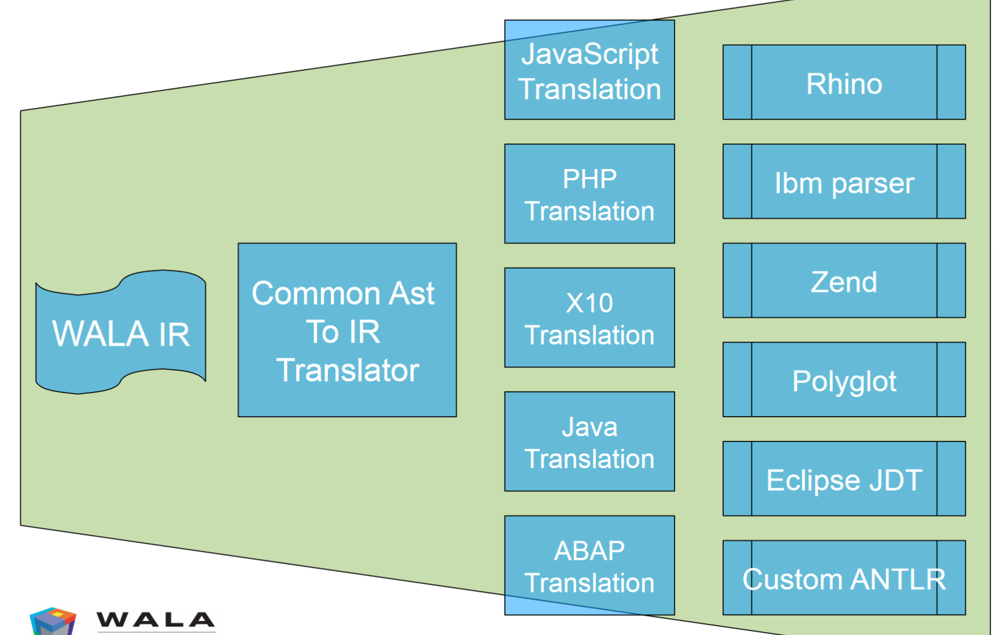
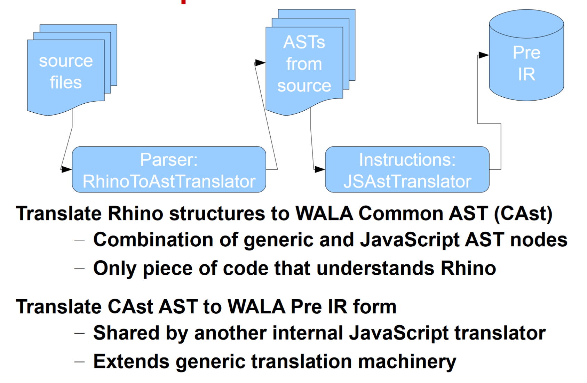

## Demo Main project
- add our project into root settings.gradle
- config our project
- to fix `task ':com.sjtu.lw:compileJavaUsingEcj' error`, add `.settings/org.eclipse.jdt.core.prefs`
- build `./gradlew :com.sjtu.lw:build`, run `./gradlew :com.sjtu.lw:run`
- add dependency in build.gradle, but code hint reports error `cannot find dependency`. 
  - Reason:See 'Project Configuration as Derived Model' in README-Gradle.md.
  - Solution: in Gradle view, click our project, right click, choose 'reload gradle project'

## WALA 10 PLDI tutorial


### 1. general utilities
- WALA data structure


- bit set
  - 文件路径：com.ibm.wala.util/src/main/java/com/ibm/wala/util/collections
  
- basic graph
  - 文件路径：com.ibm.wala.util/src/main/java/com/ibm/wala/util/graph
  
  - BFS and DFS
- Dataflow system
  
- example
  
  - 文件路径: com.ibm.wala.core/src/test/java/com/ibm/wala/core/tests/basic/GraphDataflowTest.java

  - 核心代码
  ```java
  BitVectorFramework<String, String> F = new BitVectorFramework<>(G, functions, values);
  BitVectorSolver<String> s = new BitVectorSolver<>(F);
  s.solve(null);
  System.out.println(result2String(s));

  // function 核心定义
  ITransferFunctionProvider<String, BitVectorVariable> functions =
        new ITransferFunctionProvider<String, BitVectorVariable>() {

          @Override
          public UnaryOperator<BitVectorVariable> getNodeTransferFunction(String node) {
            return new BitVectorUnionConstant(values.getMappedIndex(node));
          }

          @Override
          public boolean hasNodeTransferFunctions() {
            return true;
          }
          ...
        };
  ```

### 2. intermediate representation
- SSAInstruction
  - com.ibm.wala.core/com/ibm/wala/ssa/SSAInstruction.java

### 3. scopes and class hierarchies

### 4. interprocedural dataflow analysis
- Tabulation-Based Analysis

### 5. Call Graph & Point Analysis

### 6. Slicing

### 7. instrumenting bytecodes with shrike

### 8. Front ends / CAST (P83)
- WALA Front End


- WALA Source Code Front End


- CAst IR Generation


  - JS Instruction Generation 
  


